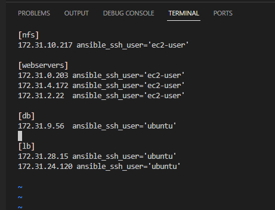
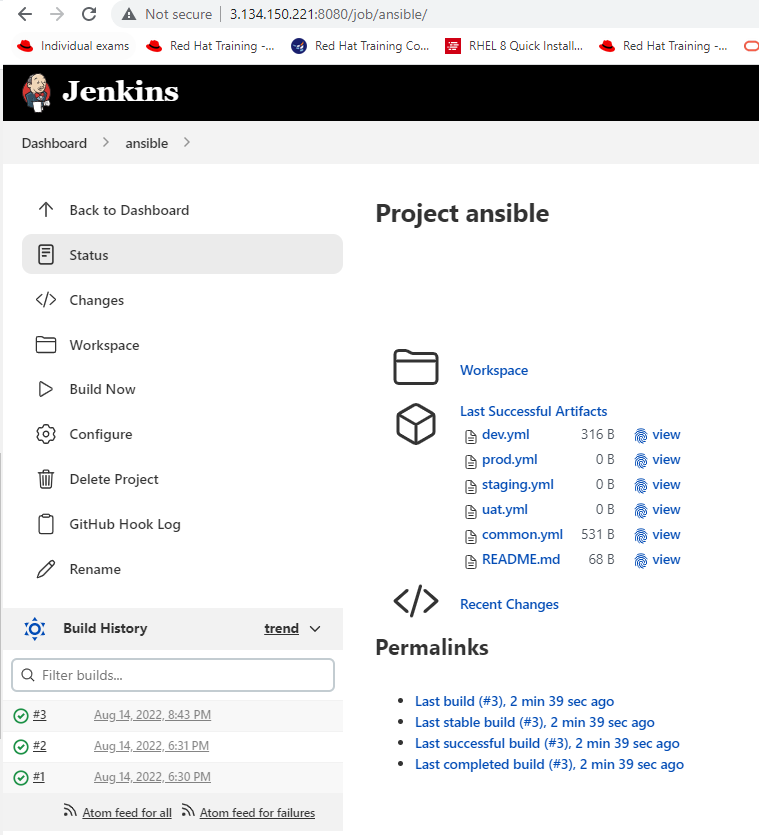
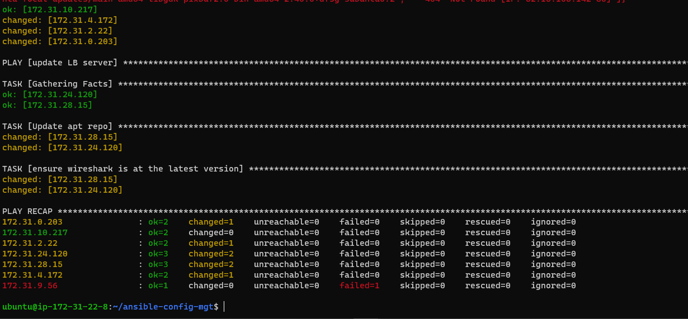

# ANSIBLE CONFIGURATION MANAGEMENT – AUTOMATE PROJECT 7 TO 10

### Task
* To Install and configure Ansible client to act as a Jump Server/Bastion Host
* To Create a simple Ansible playbook to automate servers configuration

### Updated the  Name tag on my Jenkins Instance to Jenkins-Ansible, and a new repository created named ansible-config-mgt on my Github

* Installed Ansible on my existing Jenkins Server

` sudo apt update `

` sudo apt install ansible `

` ansible --version ` 

* Created a new Freestyle project called ansible in Jenkins and pointed it to ymy ‘ansible-config-mgt’ repository.

* Configure Webhook in GitHub and set webhook to trigger ansible build.

* Configured a Post-build job to save all (**) files, like you did it in Project 9.

* Made some changes in README.MD file in master branch to test if the builds starts automatically and Jenkins saves the files (build artifacts) in the following folder ls /var/lib/jenkins/jobs/ansible/builds/2/archive/

### Step 2 – Prepared development environment using Visual Studio Code

*  VSC configured and connected my newly created GitHub repository.

* Cloned down your ansible-config-mgt repo to your Jenkins-Ansible instance

`  git clone git@github.com:babalola1234/ansible-config-mgt.git ` 

### BEGIN ANSIBLE DEVELOPMENT
* In my ansible-config-mgt GitHub repository, created a new branch called feature/prj-101-ansible.

* Checked out my newly created feature branch to my local machine.

* Created a directory named inventory, and touched 4 files as follows dev.yml, staging.yml, uat.yml, and prod.yml respectively.

* Created another dir named playbooks, in it I touched a file called common.yml

### Step 4 – Set up an Ansible Inventory

* installed ssh-agent on my jenkins-Ansible server

` ssh-add `

* Confirmed  the key has been added with the command below,

` ssh-add -l `

* ssh into Jenkins-Ansible server using ssh-agent

` ssh -A ubuntu@3.134.150.221 `

* Updated my inventory/dev.yml file with the below 

### Step 5 – Created a Common Playbook --common.yml and updated with the below codes

![image of commom.yml]

### Step 6 – Updated GITHUB with the latest code from my local machine

` git status `

` git add .  

` git commit -m "code update" `

* Created a Pull request (PR)

* jenkins did the automation for after the codes were merged

### Step 7 – Runing first Ansible test

` cd ansible-config-mgt `

` ansible-playbook -i inventory/dev.yml playbooks/common.yml ` 

